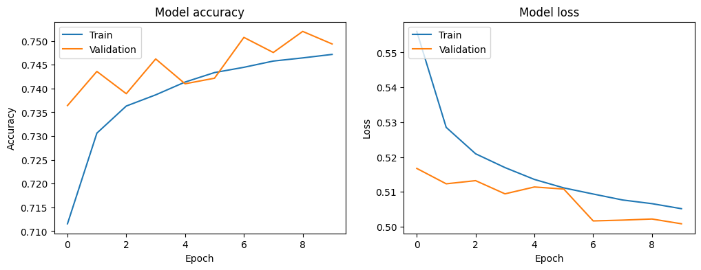

# LSTM-CNN Sentiment Analysis on Rotten Tomatoes Reviews

Student ID: 23C11024

Student name: Chiêm Quốc Hùng

## Introduction

This is a homework for HCMUS' Deep Learning course. The homework is based on Dr. Nguyen Tien Huy's work on the paper Multi-channel LSTM-CNN model for Vietnamesesentiment analysis ([link here](https://www.researchgate.net/publication/321259272_Multi-channel_LSTM-CNN_model_for_Vietnamese_sentiment_analysis)).

The datasets can be found in the links below:
1. Base dataset (~400mb): [rotten_tomatoes_movie_reviews.csv](https://www.kaggle.com/datasets/andrezaza/clapper-massive-rotten-tomatoes-movies-and-reviews)
2. Additional testing dataset (~200mb): [rotten_tomatoes_critic_reviews.csv](https://www.kaggle.com/datasets/stefanoleone992/rotten-tomatoes-movies-and-critic-reviews-dataset)
3. GloVe word embeddings (~1.3gb): [glove.6B.zip](https://nlp.stanford.edu/data/glove.6B.zip)

## Import dataset


```python
import spacy
import pandas as pd
import numpy as np
import tensorflow as tf
import matplotlib.pyplot as plt
from tensorflow.keras.preprocessing.text import Tokenizer
from tensorflow.keras.preprocessing.sequence import pad_sequences
from keras.models import Model
from keras.layers import Input, Embedding, LSTM, Conv1D, GlobalMaxPooling1D, concatenate, Dense, Dropout, BatchNormalization
from keras.utils import to_categorical
from sklearn.model_selection import train_test_split
from concurrent.futures import ProcessPoolExecutor
```

    2024-06-24 02:02:47.928076: I tensorflow/core/platform/cpu_feature_guard.cc:210] This TensorFlow binary is optimized to use available CPU instructions in performance-critical operations.
    To enable the following instructions: AVX2 FMA, in other operations, rebuild TensorFlow with the appropriate compiler flags.
    2024-06-24 02:02:48.637607: W tensorflow/compiler/tf2tensorrt/utils/py_utils.cc:38] TF-TRT Warning: Could not find TensorRT


```python
# Check if TensorFlow is using GPU
print("Num GPUs Available: ", len(tf.config.list_physical_devices('GPU')))
```

    Num GPUs Available:  1


    2024-06-24 02:02:49.958438: I external/local_xla/xla/stream_executor/cuda/cuda_executor.cc:984] could not open file to read NUMA node: /sys/bus/pci/devices/0000:01:00.0/numa_node
    Your kernel may have been built without NUMA support.
    2024-06-24 02:02:50.083696: I external/local_xla/xla/stream_executor/cuda/cuda_executor.cc:984] could not open file to read NUMA node: /sys/bus/pci/devices/0000:01:00.0/numa_node
    Your kernel may have been built without NUMA support.
    2024-06-24 02:02:50.083759: I external/local_xla/xla/stream_executor/cuda/cuda_executor.cc:984] could not open file to read NUMA node: /sys/bus/pci/devices/0000:01:00.0/numa_node
    Your kernel may have been built without NUMA support.


```python
# Load spaCy model
nlp = spacy.load('en_core_web_sm', disable=['ner', 'parser'])

# Function to filter text by POS
def filter_text_by_pos(text):
    doc = nlp(text)
    filtered_text = " ".join([token.text for token in doc if token.pos_ in ['VERB', 'ADJ', 'ADV']])
    return filtered_text

# Function to apply POS filtering to a list of texts
def process_texts(texts):
    return [filter_text_by_pos(text) for text in texts]
```


```python
# Load pre-trained GloVe embeddings
def load_glove_embeddings(glove_path, tokenizer, embedding_dim):
    embeddings_index = {}
    with open(glove_path, 'r', encoding='utf8') as f:
        for line in f:
            values = line.split()
            word = values[0]
            coefs = np.asarray(values[1:], dtype='float32')
            embeddings_index[word] = coefs

    embedding_matrix = np.zeros((len(tokenizer.word_index) + 1, embedding_dim))
    for word, i in tokenizer.word_index.items():
        embedding_vector = embeddings_index.get(word)
        if embedding_vector is not None:
            embedding_matrix[i] = embedding_vector

    return embedding_matrix
```


```python
data = pd.read_csv("./rotten_tomatoes_movie_reviews.csv")
data.head()
```


<div>
<style scoped>
    .dataframe tbody tr th:only-of-type {
        vertical-align: middle;
    }

    .dataframe tbody tr th {
        vertical-align: top;
    }

    .dataframe thead th {
        text-align: right;
    }
</style>
<table border="1" class="dataframe">
  <thead>
    <tr style="text-align: right;">
      <th></th>
      <th>id</th>
      <th>reviewId</th>
      <th>creationDate</th>
      <th>criticName</th>
      <th>isTopCritic</th>
      <th>originalScore</th>
      <th>reviewState</th>
      <th>publicatioName</th>
      <th>reviewText</th>
      <th>scoreSentiment</th>
      <th>reviewUrl</th>
    </tr>
  </thead>
  <tbody>
    <tr>
      <th>0</th>
      <td>beavers</td>
      <td>1145982</td>
      <td>2003-05-23</td>
      <td>Ivan M. Lincoln</td>
      <td>False</td>
      <td>3.5/4</td>
      <td>fresh</td>
      <td>Deseret News (Salt Lake City)</td>
      <td>Timed to be just long enough for most youngste...</td>
      <td>POSITIVE</td>
      <td>http://www.deseretnews.com/article/700003233/B...</td>
    </tr>
    <tr>
      <th>1</th>
      <td>blood_mask</td>
      <td>1636744</td>
      <td>2007-06-02</td>
      <td>The Foywonder</td>
      <td>False</td>
      <td>1/5</td>
      <td>rotten</td>
      <td>Dread Central</td>
      <td>It doesn't matter if a movie costs 300 million...</td>
      <td>NEGATIVE</td>
      <td>http://www.dreadcentral.com/index.php?name=Rev...</td>
    </tr>
    <tr>
      <th>2</th>
      <td>city_hunter_shinjuku_private_eyes</td>
      <td>2590987</td>
      <td>2019-05-28</td>
      <td>Reuben Baron</td>
      <td>False</td>
      <td>NaN</td>
      <td>fresh</td>
      <td>CBR</td>
      <td>The choreography is so precise and lifelike at...</td>
      <td>POSITIVE</td>
      <td>https://www.cbr.com/city-hunter-shinjuku-priva...</td>
    </tr>
    <tr>
      <th>3</th>
      <td>city_hunter_shinjuku_private_eyes</td>
      <td>2558908</td>
      <td>2019-02-14</td>
      <td>Matt Schley</td>
      <td>False</td>
      <td>2.5/5</td>
      <td>rotten</td>
      <td>Japan Times</td>
      <td>The film's out-of-touch attempts at humor may ...</td>
      <td>NEGATIVE</td>
      <td>https://www.japantimes.co.jp/culture/2019/02/0...</td>
    </tr>
    <tr>
      <th>4</th>
      <td>dangerous_men_2015</td>
      <td>2504681</td>
      <td>2018-08-29</td>
      <td>Pat Padua</td>
      <td>False</td>
      <td>NaN</td>
      <td>fresh</td>
      <td>DCist</td>
      <td>Its clumsy determination is endearing and some...</td>
      <td>POSITIVE</td>
      <td>http://dcist.com/2015/11/out_of_frame_dangerou...</td>
    </tr>
  </tbody>
</table>
</div>


## Data cleaning


```python
# Drop missing reviewText rows
data = data.dropna(subset=['reviewText'])

# Only use reviewState (result) and reviewText columns
data = data[['reviewState', 'reviewText']]

# Encode sentiment
data['sentiment'] = data['reviewState'].apply(lambda x: 1 if x == 'fresh' else 0)

data.head()
```


<div>
<style scoped>
    .dataframe tbody tr th:only-of-type {
        vertical-align: middle;
    }

    .dataframe tbody tr th {
        vertical-align: top;
    }

    .dataframe thead th {
        text-align: right;
    }
</style>
<table border="1" class="dataframe">
  <thead>
    <tr style="text-align: right;">
      <th></th>
      <th>reviewState</th>
      <th>reviewText</th>
      <th>sentiment</th>
    </tr>
  </thead>
  <tbody>
    <tr>
      <th>0</th>
      <td>fresh</td>
      <td>Timed to be just long enough for most youngste...</td>
      <td>1</td>
    </tr>
    <tr>
      <th>1</th>
      <td>rotten</td>
      <td>It doesn't matter if a movie costs 300 million...</td>
      <td>0</td>
    </tr>
    <tr>
      <th>2</th>
      <td>fresh</td>
      <td>The choreography is so precise and lifelike at...</td>
      <td>1</td>
    </tr>
    <tr>
      <th>3</th>
      <td>rotten</td>
      <td>The film's out-of-touch attempts at humor may ...</td>
      <td>0</td>
    </tr>
    <tr>
      <th>4</th>
      <td>fresh</td>
      <td>Its clumsy determination is endearing and some...</td>
      <td>1</td>
    </tr>
  </tbody>
</table>
</div>


## Training and testing data preparation


```python
# Extract texts and labels
texts = data['reviewText'].values
labels = data['sentiment'].values

# Train-test split
x_train, x_test, y_train, y_test = train_test_split(texts, labels, test_size=0.2, random_state=69)

# Apply POS filtering to the training set only
# Split the data into chunks for parallel processing
num_chunks = 8
chunks = np.array_split(x_train, num_chunks)

# Process the chunks in parallel
with ProcessPoolExecutor(max_workers=num_chunks) as executor:
    x_train_filtered_chunks = list(executor.map(process_texts, chunks))

# Combine the chunks back into a single list
x_train_filtered = [item for sublist in x_train_filtered_chunks for item in sublist]
```


```python
# Parameters
max_features = 1000
max_len = 100
embedding_dim = 50
num_classes = 2

# Text tokenizing
tokenizer = Tokenizer(num_words=max_features)
tokenizer.fit_on_texts(x_train_filtered)
x_train_sequences = tokenizer.texts_to_sequences(x_train_filtered)
x_test_sequences = tokenizer.texts_to_sequences(x_test)

# Pad sequences
x_train_padded = pad_sequences(x_train_sequences, maxlen=max_len)
x_test_padded = pad_sequences(x_test_sequences, maxlen=max_len)

# Convert labels to categorical
y_train_categorical = to_categorical(np.asarray(y_train))
y_test_categorical = to_categorical(np.asarray(y_test))
```

## Model layers


```python
glove_path = './glove.6B/glove.6B.50d.txt'
embedding_matrix = load_glove_embeddings(glove_path, tokenizer, embedding_dim)

# Embedding layer with pre-trained weights
embedding_layer = Embedding(len(tokenizer.word_index) + 1,
                            embedding_dim,
                            weights=[embedding_matrix],
                            trainable=False)
```

    2024-06-24 02:12:20.425267: I external/local_xla/xla/stream_executor/cuda/cuda_executor.cc:984] could not open file to read NUMA node: /sys/bus/pci/devices/0000:01:00.0/numa_node
    Your kernel may have been built without NUMA support.
    2024-06-24 02:12:20.425428: I external/local_xla/xla/stream_executor/cuda/cuda_executor.cc:984] could not open file to read NUMA node: /sys/bus/pci/devices/0000:01:00.0/numa_node
    Your kernel may have been built without NUMA support.
    2024-06-24 02:12:20.425473: I external/local_xla/xla/stream_executor/cuda/cuda_executor.cc:984] could not open file to read NUMA node: /sys/bus/pci/devices/0000:01:00.0/numa_node
    Your kernel may have been built without NUMA support.
    2024-06-24 02:12:20.616000: I external/local_xla/xla/stream_executor/cuda/cuda_executor.cc:984] could not open file to read NUMA node: /sys/bus/pci/devices/0000:01:00.0/numa_node
    Your kernel may have been built without NUMA support.
    2024-06-24 02:12:20.616105: I external/local_xla/xla/stream_executor/cuda/cuda_executor.cc:984] could not open file to read NUMA node: /sys/bus/pci/devices/0000:01:00.0/numa_node
    Your kernel may have been built without NUMA support.
    2024-06-24 02:12:20.616123: I tensorflow/core/common_runtime/gpu/gpu_device.cc:2019] Could not identify NUMA node of platform GPU id 0, defaulting to 0.  Your kernel may not have been built with NUMA support.
    2024-06-24 02:12:20.616204: I external/local_xla/xla/stream_executor/cuda/cuda_executor.cc:984] could not open file to read NUMA node: /sys/bus/pci/devices/0000:01:00.0/numa_node
    Your kernel may have been built without NUMA support.
    2024-06-24 02:12:20.640413: I tensorflow/core/common_runtime/gpu/gpu_device.cc:1928] Created device /job:localhost/replica:0/task:0/device:GPU:0 with 4047 MB memory:  -> device: 0, name: NVIDIA GeForce RTX 2060, pci bus id: 0000:01:00.0, compute capability: 7.5


```python
# LSTM branch (with Batch Normalization and Dropout)
lstm_input = Input(shape=(max_len,))
embedded_sequences_lstm = embedding_layer(lstm_input)
lstm_out = LSTM(128, return_sequences=True)(embedded_sequences_lstm)
lstm_out = BatchNormalization()(lstm_out) # Batch Normalization helps to normalize activations and speed up convergence
lstm_out = Dropout(0.5)(lstm_out) # Dropout = 0.5 helps to prevent overfitting
lstm_out = LSTM(64)(lstm_out)
lstm_out = BatchNormalization()(lstm_out)
lstm_out = Dropout(0.5)(lstm_out)

# CNN layer branch (with Batch Normalization and Dropout)
cnn_input = Input(shape=(max_len,))
embedded_sequences_cnn = embedding_layer(cnn_input)
cnn_out = Conv1D(128, 5, activation='relu')(embedded_sequences_cnn)
cnn_out = BatchNormalization()(cnn_out)
cnn_out = Dropout(0.5)(cnn_out)
cnn_out = Conv1D(64, 5, activation='relu')(cnn_out)
cnn_out = BatchNormalization()(cnn_out)
cnn_out = Dropout(0.5)(cnn_out)
cnn_out = GlobalMaxPooling1D()(cnn_out)

# Concatenate LSTM and CNN outputs
merged = concatenate([lstm_out, cnn_out])
merged = Dense(64, activation='relu')(merged)
merged = BatchNormalization()(merged)
merged = Dropout(0.5)(merged)
pred = Dense(num_classes, activation='softmax')(merged)

# Build model
model = Model(inputs=[lstm_input, cnn_input], outputs=pred)
model.compile(optimizer='adam', loss='categorical_crossentropy', metrics=['accuracy'])
```

## Train and evaluate model


```python
# Train model
history = model.fit([x_train_padded, x_train_padded], y_train_categorical, epochs=10, batch_size=32, validation_split=0.2)
```

    Epoch 1/10


    2024-06-24 02:12:26.358728: I external/local_xla/xla/stream_executor/cuda/cuda_dnn.cc:465] Loaded cuDNN version 8907


    27515/27515 ━━━━━━━━━━━━━━━━━━━━ 1089s 39ms/step - accuracy: 0.6913 - loss: 0.5911 - val_accuracy: 0.7364 - val_loss: 0.5167
    Epoch 2/10
    27515/27515 ━━━━━━━━━━━━━━━━━━━━ 958s 35ms/step - accuracy: 0.7288 - loss: 0.5309 - val_accuracy: 0.7436 - val_loss: 0.5123
    Epoch 3/10
    27515/27515 ━━━━━━━━━━━━━━━━━━━━ 953s 35ms/step - accuracy: 0.7362 - loss: 0.5217 - val_accuracy: 0.7389 - val_loss: 0.5132
    Epoch 4/10
    27515/27515 ━━━━━━━━━━━━━━━━━━━━ 950s 35ms/step - accuracy: 0.7388 - loss: 0.5170 - val_accuracy: 0.7462 - val_loss: 0.5094
    Epoch 5/10
    27515/27515 ━━━━━━━━━━━━━━━━━━━━ 956s 35ms/step - accuracy: 0.7411 - loss: 0.5133 - val_accuracy: 0.7410 - val_loss: 0.5114
    Epoch 6/10
    27515/27515 ━━━━━━━━━━━━━━━━━━━━ 955s 35ms/step - accuracy: 0.7439 - loss: 0.5105 - val_accuracy: 0.7422 - val_loss: 0.5108
    Epoch 7/10
    27515/27515 ━━━━━━━━━━━━━━━━━━━━ 961s 35ms/step - accuracy: 0.7448 - loss: 0.5093 - val_accuracy: 0.7508 - val_loss: 0.5017
    Epoch 8/10
    27515/27515 ━━━━━━━━━━━━━━━━━━━━ 961s 35ms/step - accuracy: 0.7462 - loss: 0.5072 - val_accuracy: 0.7476 - val_loss: 0.5019
    Epoch 9/10
    27515/27515 ━━━━━━━━━━━━━━━━━━━━ 958s 35ms/step - accuracy: 0.7461 - loss: 0.5069 - val_accuracy: 0.7520 - val_loss: 0.5022
    Epoch 10/10
    27515/27515 ━━━━━━━━━━━━━━━━━━━━ 959s 35ms/step - accuracy: 0.7484 - loss: 0.5037 - val_accuracy: 0.7494 - val_loss: 0.5009


```python
# Evaluate model
score = model.evaluate([x_test_padded, x_test_padded], y_test_categorical)
print(f"Test accuracy: {score[1]}")
```

    8599/8599 ━━━━━━━━━━━━━━━━━━━━ 109s 13ms/step - accuracy: 0.7412 - loss: 0.5101
    Test accuracy: 0.742011547088623


```python
# Plot training & validation accuracy values
plt.figure(figsize=(12, 4))
plt.subplot(1, 2, 1)
plt.plot(history.history['accuracy'])
plt.plot(history.history['val_accuracy'])
plt.title('Model accuracy')
plt.xlabel('Epoch')
plt.ylabel('Accuracy')
plt.legend(['Train', 'Validation'], loc='upper left')

# Plot training & validation loss values
plt.subplot(1, 2, 2)
plt.plot(history.history['loss'])
plt.plot(history.history['val_loss'])
plt.title('Model loss')
plt.xlabel('Epoch')
plt.ylabel('Loss')
plt.legend(['Train', 'Validation'], loc='upper left')

plt.show()
```


    

    


## Additional testing


```python
data = pd.read_csv("./rotten_tomatoes_critic_reviews.csv")
data.head()
```


<div>
<style scoped>
    .dataframe tbody tr th:only-of-type {
        vertical-align: middle;
    }

    .dataframe tbody tr th {
        vertical-align: top;
    }

    .dataframe thead th {
        text-align: right;
    }
</style>
<table border="1" class="dataframe">
  <thead>
    <tr style="text-align: right;">
      <th></th>
      <th>rotten_tomatoes_link</th>
      <th>critic_name</th>
      <th>top_critic</th>
      <th>publisher_name</th>
      <th>review_type</th>
      <th>review_score</th>
      <th>review_date</th>
      <th>review_content</th>
    </tr>
  </thead>
  <tbody>
    <tr>
      <th>0</th>
      <td>m/0814255</td>
      <td>Andrew L. Urban</td>
      <td>False</td>
      <td>Urban Cinefile</td>
      <td>Fresh</td>
      <td>NaN</td>
      <td>2010-02-06</td>
      <td>A fantasy adventure that fuses Greek mythology...</td>
    </tr>
    <tr>
      <th>1</th>
      <td>m/0814255</td>
      <td>Louise Keller</td>
      <td>False</td>
      <td>Urban Cinefile</td>
      <td>Fresh</td>
      <td>NaN</td>
      <td>2010-02-06</td>
      <td>Uma Thurman as Medusa, the gorgon with a coiff...</td>
    </tr>
    <tr>
      <th>2</th>
      <td>m/0814255</td>
      <td>NaN</td>
      <td>False</td>
      <td>FILMINK (Australia)</td>
      <td>Fresh</td>
      <td>NaN</td>
      <td>2010-02-09</td>
      <td>With a top-notch cast and dazzling special eff...</td>
    </tr>
    <tr>
      <th>3</th>
      <td>m/0814255</td>
      <td>Ben McEachen</td>
      <td>False</td>
      <td>Sunday Mail (Australia)</td>
      <td>Fresh</td>
      <td>3.5/5</td>
      <td>2010-02-09</td>
      <td>Whether audiences will get behind The Lightnin...</td>
    </tr>
    <tr>
      <th>4</th>
      <td>m/0814255</td>
      <td>Ethan Alter</td>
      <td>True</td>
      <td>Hollywood Reporter</td>
      <td>Rotten</td>
      <td>NaN</td>
      <td>2010-02-10</td>
      <td>What's really lacking in The Lightning Thief i...</td>
    </tr>
  </tbody>
</table>
</div>


```python
# Drop missing review_content rows
data = data.dropna(subset=['review_content'])

# Only use review_type (result) and review_content columns
data = data[['review_type', 'review_content']]

# Encode sentiment
data['sentiment'] = data['review_type'].apply(lambda x: 1 if x == 'Fresh' else 0)

data.head()
```


<div>
<style scoped>
    .dataframe tbody tr th:only-of-type {
        vertical-align: middle;
    }

    .dataframe tbody tr th {
        vertical-align: top;
    }

    .dataframe thead th {
        text-align: right;
    }
</style>
<table border="1" class="dataframe">
  <thead>
    <tr style="text-align: right;">
      <th></th>
      <th>review_type</th>
      <th>review_content</th>
      <th>sentiment</th>
    </tr>
  </thead>
  <tbody>
    <tr>
      <th>0</th>
      <td>Fresh</td>
      <td>A fantasy adventure that fuses Greek mythology...</td>
      <td>1</td>
    </tr>
    <tr>
      <th>1</th>
      <td>Fresh</td>
      <td>Uma Thurman as Medusa, the gorgon with a coiff...</td>
      <td>1</td>
    </tr>
    <tr>
      <th>2</th>
      <td>Fresh</td>
      <td>With a top-notch cast and dazzling special eff...</td>
      <td>1</td>
    </tr>
    <tr>
      <th>3</th>
      <td>Fresh</td>
      <td>Whether audiences will get behind The Lightnin...</td>
      <td>1</td>
    </tr>
    <tr>
      <th>4</th>
      <td>Rotten</td>
      <td>What's really lacking in The Lightning Thief i...</td>
      <td>0</td>
    </tr>
  </tbody>
</table>
</div>


```python
# Extract texts and labels
texts = data['review_content'].values
labels = data['sentiment'].values

# Text tokenizing
tokenizer = Tokenizer(num_words=max_features)
tokenizer.fit_on_texts(texts)
sequences = tokenizer.texts_to_sequences(texts)
word_index = tokenizer.word_index

# Pad sequences
data = pad_sequences(sequences, maxlen=max_len)

# Convert labels to categorical
labels = to_categorical(np.asarray(labels))
```


```python
# Evaluate model
score = model.evaluate([data, data], labels)
print(f"Test accuracy: {score[1]}")
```

    33257/33257 ━━━━━━━━━━━━━━━━━━━━ 418s 13ms/step - accuracy: 0.5973 - loss: 0.8537
    Test accuracy: 0.6047908067703247


Results from the additional testing dataset:

| Model | Accuracy | Loss |
| --- | --- | --- |
| Initial model (64/128) | 0.5530 | 1.0205 |
| Bigger model (128/256) with Batch Normalization and Dropout + Filtered content for training | 0.5806 | 0.7253 |
| Node-reduced model (64/128) + Filtered content + GloVe 6B 50d word embedding + 10 epochs | 0.5973 | 0.8537 |
